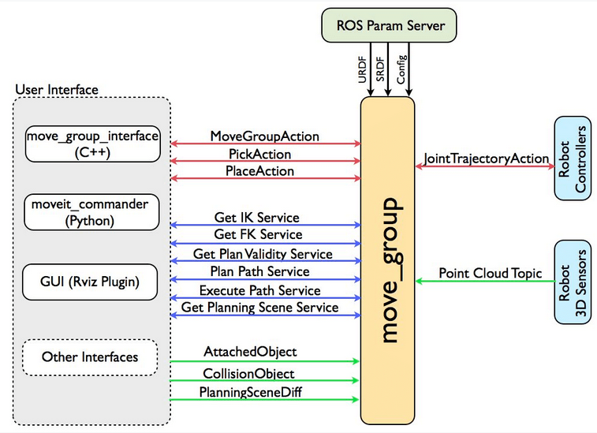
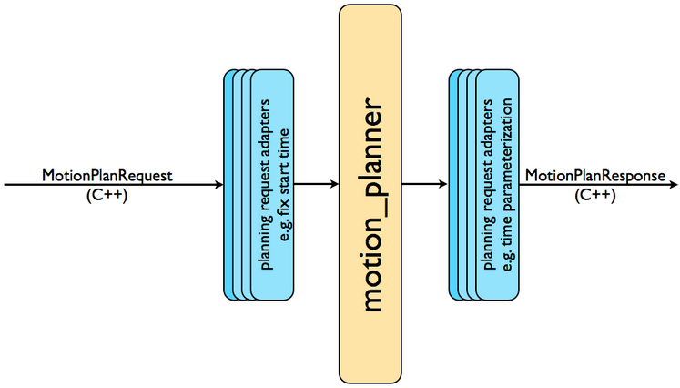
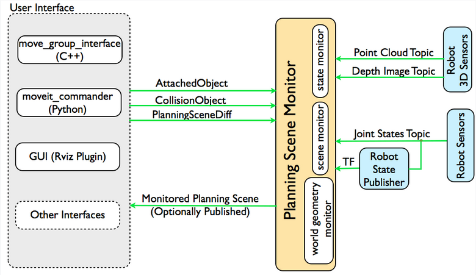

# System Architecture

## The move_group node

- `move_group` is the primary node provided by MoveIt
- It serves as an _integrator_: pulling all the individual components together to provide a set of ROS actions and services

### User Interface

- C++: Using the [move_group_interface](http://docs.ros.org/noetic/api/moveit_ros_planning_interface/html/classmoveit_1_1planning__interface_1_1MoveGroupInterface.html)
- Python: Using the [moveit_commander](http://docs.ros.org/noetic/api/moveit_commander/html/classmoveit__commander_1_1move__group_1_1MoveGroupCommander.html) package

### Configuration

`move_group` is configured using the ROS param server from where it will also get the URDF and SRDF for the robot

### Robot Interface

#### Joint State Information
- `move_group` listens to the _/joint_states_ topic for determining the current state of the joints.
- The publisher for this topic has to be implemented on each robot

#### Transform Information
- Fetches information about frame transforms from the ROS TF library
- To publish TF information from the robot, need to setup _robot_state_publisher_ node

#### Controller Interface
- `move_group` talks to the controllers on the robot using the _FollowJointTrajectoryAction_ interface
- A server on the robot needs to service this action

#### Planning scene
- `move_group` uses the Planning Scene Monitor to maintain a _planning scene_, which is a representation of the world and the current state of the robot

# Motion Planning

## The Motion Planning Plugin

- MoveIt works with motion planners through a plugin interface so that different motion planners can be used easily
- The interface is through a ROS Action or service offered by the `move_group` node
- There are three motion planning libraries supported by MoveIt
    - OMPL (default)
    - Pilz industrial
    - CHOMP

## The Motion Plan Request

- Move an arm (in joint space) or the EE to a new pose
- Collisions are checked for by default
- Specify the planner via the _planning_pipeline_ and the _planner_id_ parameters
- Specify any additional constraints

## The Motion Plan Result

Given a request, `move_group` generates a trajectory, respecting the velocity and acceleration constraints at the joint level

# OMPL

- MoveIt integrates directly with OMPL (Open Motion Planning Library) and uses motion planners from that library as its primary/default set of planners
- The _planning scene_ is used to represent the world around the robot and also stores the state of the robot itself.
- It is maintained by the _planning scene monitor_ inside the _move group_ node

### State Monitor

Keeps track of the state of the robot from the _joint_states_ topic

### World Geometry Monitor

- Builds a 3D representation of the world around the robot using the information from the sensors and from user input
- Uses _occupancy map monitor_ to build the 3D representation and augments that with the information on the _planning scene_ topic for adding object information
- The _occupancy map monitor_ uses a plugin architecture to handle different kinds of sensor input.
- MoveIt has inbuilt support for two kinds of inputs:
    - **Point clouds**: handled by the _point cloud occupancy map updater_ plugin
    - **Depth images**: handled by the _depth image occupancy map updater_ plugin

### Octomap

- The _occupancy map monitor_ uses an _Octomap_ to maintain the occupancy map of the environment
- The _Octomap_ can directly be passed into FCL

# Collision Checking
